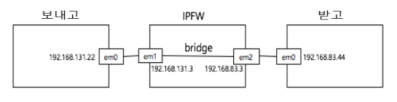

# IPFW 방화벽 테스트

## 1. 환경설정
* OS : FreeBSD-11.1-RELEASE

## 2. 실습환경

* IPFW에 Rule을 추가
* Wireshark를 이용하여 네트워크 확인

## 3. 진행사항
1. FreeBSD 정리
2. IPFW 커널모드 정리
3. IPFW 사용자모드 정리
4. Dummynet 정리
5. Phsense 구조 파악

